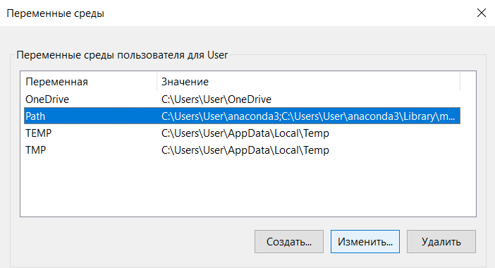

# Как Установить VS:Code ?

VS:Code (также vscode, студия, вижак, вскод) - это легковесный и расширяемый гибрид редактора текста и среды разработки. Один из самых популярных инструментов для программирования в мире на данный момент.  
В отличие от т.н. сред разработки, vscode изначально не поставляется ни с каким пакетом вспомогательных функций: заместо этого vscode имеет в себе встроеный браузер плагинов, позволяющий расширить возможности среды под ваши нужды. 
Это означает, что после установки самой программы, её придётся доводить до желаемой конфигурации, настраивать. 

## Как скачать?

- Просто качаем установщик из интернета!  
    1. Заходим на первый попавшийся сайт и выбираем нужное  
    2. Ну не совсем... Вот сайт: `code.visualstudio.com/download`  
Не буду же я совсем вас путать! Тут всё просто - надо выбрать подходящий вам вариант установщика

    3. Большинству достаточно просто нажать на большую кнопку для Windows
    4. Просто запускайте установщик и следуйте инструкциям (на втором шаге в установщике, убедитесь что у вас стоит галочка в "добавить в PATH")

<b>Следующий шаг является альтернативой, спокойно пропускайте его</b>

- Если вы фанат приключений, но всё равно на windows, то можно использовать консольную утилиту `chocolatey`!  
    1. Утилита может не быть установлена на вашем компьютере, но есть шанс, что другие программы сами её поставили.
    2. Если её нет, то просто сами установите vscode))
    3. Проверьте, что запустили консоль от имени администратора
    4. Введите команду `choco install vscode`
    5. Не забудьте согласиться, ответив A или Y.
    
    6. На скриншоте я ответил нет, т.к. у меня уже установлен vscode

## Скачал я vs code, и что дальше ?

Далее мы должны скачать расширения для нужного нам языка программирования.    
- Заходим в расширения: 
- А дальше вам придется выбрать свою сторону, черную(Python) или светлую (C++)

  - Python: вводим слово Python в поиск, и скачиваем 

  - C++: вводим с++ в поиск, и скачиваем 

- А теперь начинается самый главный шаг, полный эзотерики и веселых приключений. Компилятор с++ в отличие от питона, не идет вместе с расширением, поэтому нам придется качать его вручную (oh what fun!). 

  1. Качаем MSYS2: https://github.com/msys2/msys2-installer/releases/download/2024-01-13/msys2-x86_64-20240113.exe
ЗАПОМНИТЕ куда вы скачали msys2, это будет важно позже!

  2. После того как скачали, открываем его, именно вот такой: 

  3. Перед вами будет консоль, куда надо вставить данную комманду:  
`pacman -S --needed base-devel mingw-w64-ucrt-x86_64-toolchain`  
После чего нажимаем Enter и видим кучи строчек, так выглядит установка компилятора. Опять нажимаем Enter.
После установка остановиться и появиться строка "Proceed with installation? [Y/n], нажимаем Y или y и Enter.

- Круть у нас есть компилятор, но VScode без понятия где он находиться по дефолту, поэтому его нужно добавить в PATH.
    1. В поиске в винде ищем "Изменение системных переменных среды"   

    2. Справа снизу нажимаем на "переменные среды"
    3. Нажимаем на PATH и изменить   
  
    4. Нажимаем Создать и вводим туда путь к нашему компилятору (по дефолту C:\msys64\ucrt64\bin) 

И на этом всё, на крайняк стоит ввести в vs code строку `g++ --version` чтоб проверить что всё точно установилось.

Sidenote: В случае неудачи, проверьте свой гороскоп и лунный календарь, лично в моём случае компилятор с++ хочет самоуничтожиться при первой возможности, обновление VScode, расширения C++ и даже винды, может привести к очередной переустановке. Поэтому заглядывайте в этот файл время от времени в случае очередной поломки с++ :)

## Я не поехавший, но я хочу С++...

Мой друг, есть ещё один способ как получить под своё крыло С++, если вы на windows: ``Не быть на Windows!``  
Если серъёзно, то язык прародитель C++, а именно язык С был создан Bell Labs с целью реализовать ОС Unix, во времена, когда Microsoft ещё не существовало. ([Википедия](https://ru.wikipedia.org/wiki/Си_(язык_программирования)))  И до сих пор вся инфраструктура разработки завязанная на C/C++ крутится вокруг сообщества Linux, а потому условия наибольшего комфорта, к сожалению, не предусматривают ОС Windows.

<b>Не падать духом!</b> Уже достаточно давно существует ``WSL``(Windows subsystem for Linux) - инструмент от самих Microsoft позволяющий запускать Linux приложения в окружении Windows. Это решение позволяет бесшовно взаимодействовать приложениям под обе ОС на одной файловой системе. <b>VSCode поддерживает WSL!</b>

Вот я на windows!  

*Нажал синюю кнопку*

Вот я на Linux!  

Впечатляет? xD

## Как установить WSL?
Для использования необходимо иметь Windows 10 версии 2004 и выше (сборка 19041 и выше) или Windows 11.

1. Запускаем терминал или Powershell (что есть)  

2. Проверяем, стоит ли wsl ``wsl --help``  

3. Если выдаст ошибку вместо длинной инструкции, то смело пишем ``wsl --install`` Бояться не стоит даже если вам что-то напишут, если стандартный дистрибутив уже стоит, то команда повторной установки ничего не сделает. Если начнёт скачку, то дождитесь завершения.

4. Перезапустите ПК. Так лучше.

5. Готово! Если всё сработало, то при вводе в консоль команды ``wsl`` вы увидите консоль Linux.  

Далее устанавливаем всё те же расширения C/C++ на Vscode:  
  

Поздравляю, всё на месте!
Следующая инструкция: [Пользуемся vscode под wsl](./vscode_wsl_userguide.md)