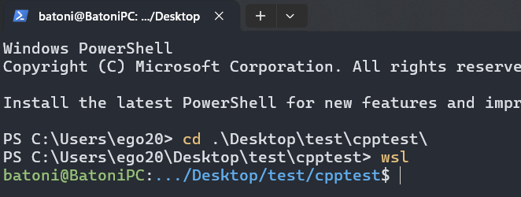
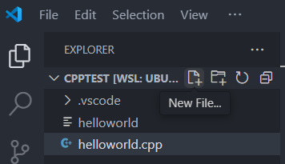
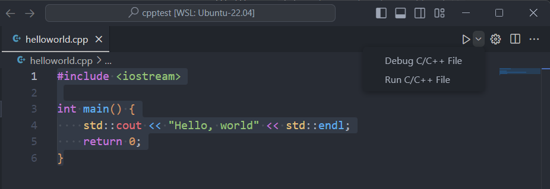
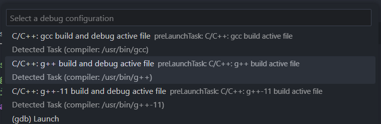
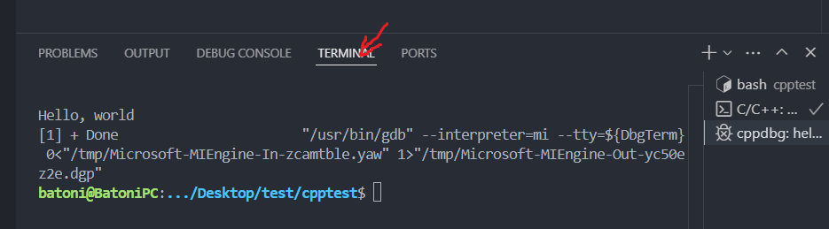
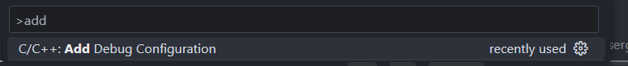

# Инструкция по применению WSL без болей и проблем!

<b>Настоятельно рекомендую сначала прочитать и выполнить инструкцию по установке vscode(глава "Я не поехавший"), затем сначала прочитать эту, и только потом выполнять!!!</b>

Для того, чтобы пользоваться VScode c WSL надо следовать некоторому простому набору инструкций.

1. Создайте пустую рабочую папку где-нибуть. Это важно, файлы из этого проекта это беспорядочный склад - запускаться в этих условиях они не будут.
2. Запустите vscode из терминала wsl в этой папке.  
Доберитьесь до нужной папки, затем запустите vscode ``code .``


3. Создайте новый файл, например ``helloworld.cpp``

4. Наберите програмку, например:  
```cpp
#include <iostream>

int main() {
    std::cout << "Hello, world" << std::endl;
    return 0;
}
```
5. Если вы установили расширение C/C++, то у увс должна быть кнопка запуска в правом верхнем углу:
  
Выбираем ``Run C/C++ File``
6. <b>ВАЖНО!</b> обязательно удостоверьтесь, что среди похожих опций вы выбрали ``g++``, если выберите ``gcc`` вы испытаете неприятности и проблемы, вам будет больно и нехорошо!   

7. Переключимся на терминал и увидим результат!

8. Если вы ошиблись и нажали не туда, то ``Ctrl + Shift + P``, начнём печатать add:  

Там снова делаем выбор ``g++``
